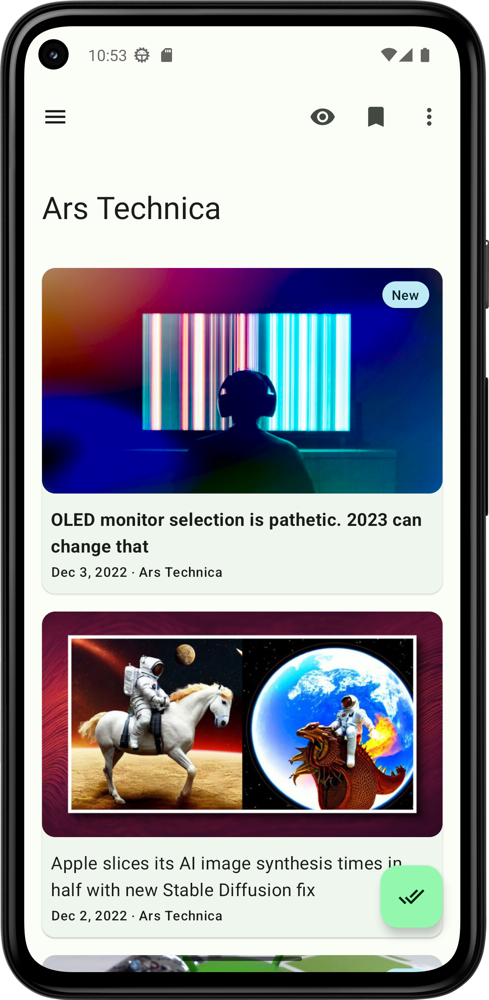
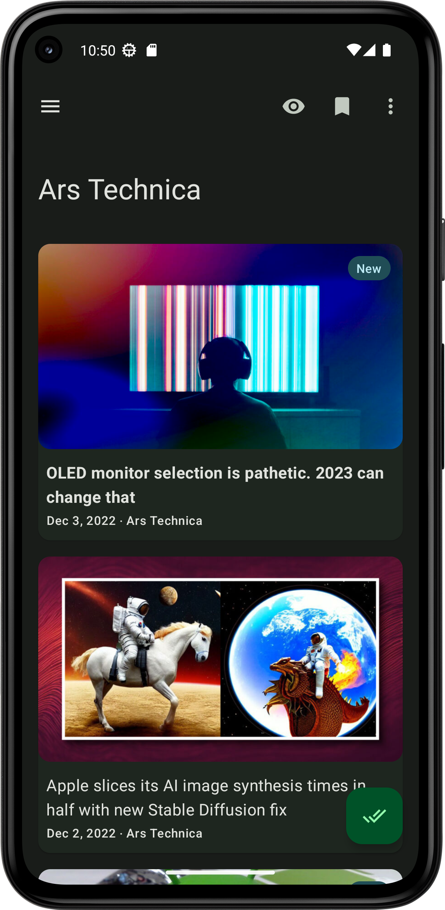
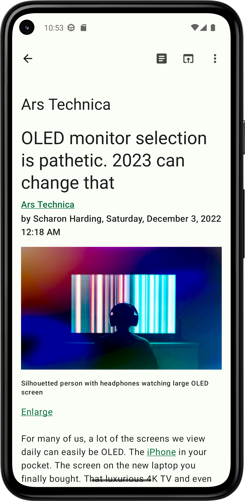
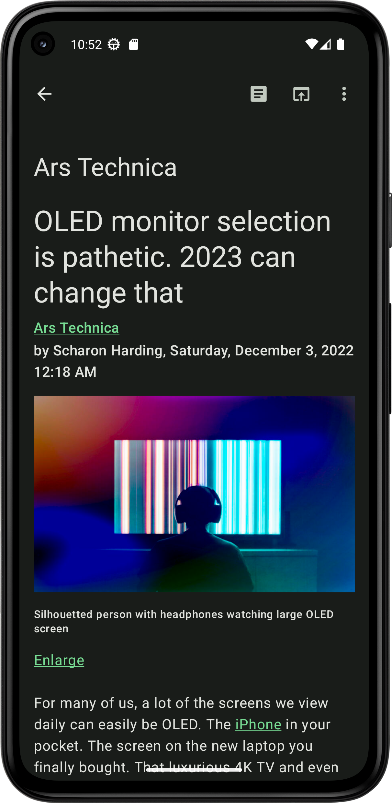
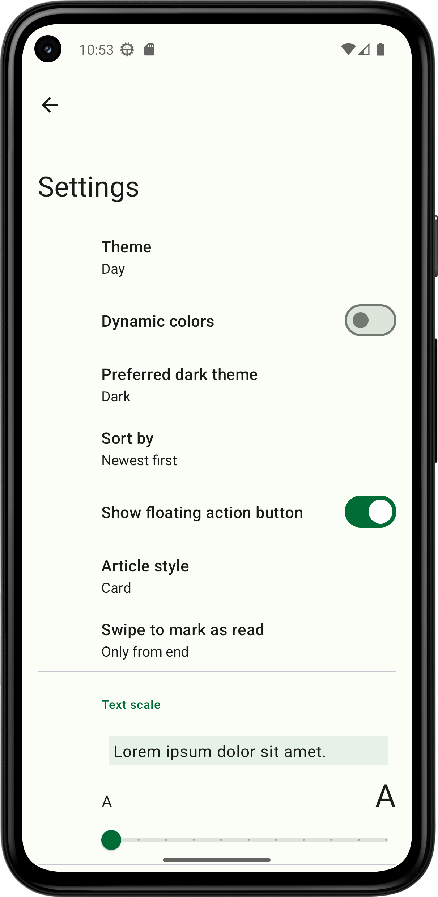
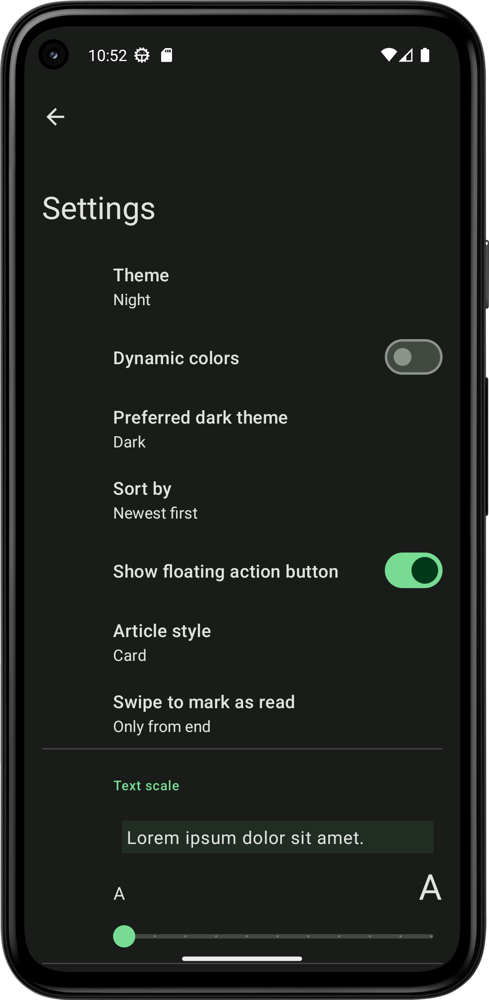

Feeder
=====

### Description

Feeder is an open source feed reader (RSS/Atom/JSONFeed) for Android created in 2014.

With Feeder you can read the latest news and posts from your favorite sites.

Feeder does NOT sync with usual remote backends so no account registration of any kind is necessary.

Feeder is free to use and runs locally on your device. Your data is 100% private.

---

### 🚀 New Features & Improvements (Added by Me)

I have modified this version of Feeder to include advanced filtering and better data management:

* **Granular Per-Feed Filtering:** * **Per-Feed Blocklist:** Unlike the original global blocklist, you can now set specific keywords for individual feeds. Blocked keywords in one feed will not affect search results in others.
    * **Per-Feed Whitelist:** Added a new option to whitelist specific keywords per feed.
    * **Accessibility:** These options are conveniently available within the **Edit Feed** menu.
* **Enhanced OPML Backup:**
    * Individual Blocklists and Whitelists are now included in **OPML Export**.
    * On reinstallation, **Importing** the OPML file automatically restores all your custom per-feed filters.
* **Saved Articles Management:**
    * Fixed issues with the existing **Export Saved Articles** feature.
    * Added a brand new **Import Saved Articles** feature, allowing users to restore their bookmarked content easily.

---

### License

**THE SOFTWARE IS PROVIDED "AS IS", WITHOUT WARRANTY OF ANY KIND**

**GPLv3**, for more info see *LICENSE*.

### Translations are welcome!

If you want to translate Feeder into your native language the easiest way is to go to [Weblate](https://hosted.weblate.org/engage/feeder/) but making a merge request is of course fine if that is something you are comfortable with.

### Quick install

Clone the project:

    git clone --recursive https://github.com/Aamish-Ejaz/Feeder_Plus-Android_App-Using_Kotlin_JetpackCompose.git

Then build and install the app to your phone which is connected via USB:

    ./gradlew installDebug

### Features

* Offline reading
* Notification support
* OPML import/export
* Material Design

### Screenshots

### Credits
Original project by [spacecowboy](https://github.com/spacecowboy/Feeder). Modifications by [Aamish-Ejaz](https://github.com/Aamish-Ejaz/Feeder_Plus-Android_App-Using_Kotlin_JetpackCompose.git).
